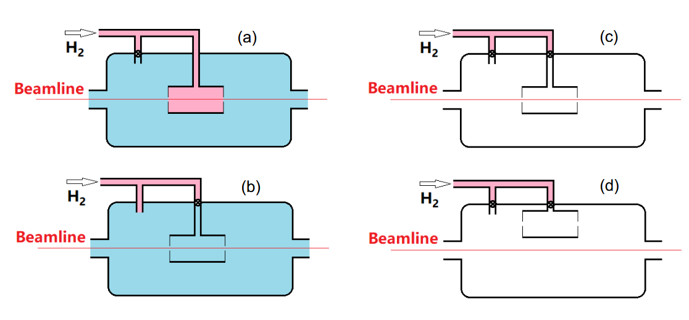

# prad2_BackgroundContamination
This software aims to quickly find the e-e and e-p Yields from PRad-II experimental data while also being able to compare runs from the 4 separate different run types. Using different combinations of these run types, one can find the various relative contributions of different background contamination source.

|Run Type|Description|
|:------:|:---------:|
|(a)|Production configuration. Gas in cell; Residual Gas in chamber; Target cell in place;|